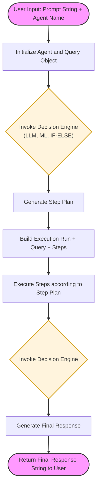

# AIPF - Agentic Intelligence Processing Framework

The name is inspired by famous **Business Object Processing Framework (BOPF)**

**So far AIPF is under heavy development!!!**

**Disclaimer**: SAP, ABAP, BTP, and BOPF are trademarks or registered trademarks of SAP SE in Germany and other countries. AIPF is an independent open-source project and is not affiliated with, sponsored by, or endorsed by SAP SE.

### Long Story Short
Standard AI calls in ABAP are stateless—they send a prompt and get a response. AIPF adds the Brain and Muscles:
**Decision Platform:** ABAP-based Decision Engine, ABAP-based Short-Term Memory Management, ABAP-based Long-Term Memory Framework, etc.
**Actionables:** Various ABAP-based Tools, etc.
The framework requires writing a significant amount of ABAP code. It is designed for developers and implies that you are proficient in writing ABAP code and have a solid understanding of concepts like APIs, HTTP, and integration patterns. You must be capable of integrating different types of APIs, such as LLMs, Machine Learning models, and various external services. Moreover, you must know how to execute these integrations within the constraints and architecture of the SAP landscape. 

### Decision Platform

Decision Platform is an ABAP class. The framework does not contain a generic implementation. The developer is responsible for writing ABAP code to provide the decision logic.
Decision logic is a broad concept. It may involve a call to an LLM, hard-coded ABAP logic, or the invocation of a Machine Learning API. Creating a Decision Platform means decomposing domain logic into manageable questions. Some of these can be decided by ABAP, while others can be decided by an LLM, etc. The Decision Platform must implement the interface ZPRU_IF_DECISION_PROVIDER. The output of the Decision Platform's work is an Execution Plan.
For each agent, the developer must insert an entry into table ZPRU_AGENT containing the name of the ABAP class for the Decision Platform.

### Execution Plan

The Execution Plan is a sequence of steps to be executed. Each step is a tool and an ABAP class that receives a string as input and provides a string as output. The next step takes the output of the previous step as its new input, and so on.

### Tool

A Tool is an ABAP class providing a piece of executable ABAP code. Additionally, a Tool contains metadata expanding and clarifying the tool's role. The Tool itself must implement the interface ZPRU_IF_TOOL_EXECUTOR and a specific tool interface, e.g., ZPRU_IF_ABAP_EXECUTOR. Alternatively, you can inherit from a specific base class, e.g., ZPRU_CL_ABAP_EXECUTOR. Each specific class contains an abstract method where the developer must provide the ABAP code.

### Tool Metadata

Tool Metadata is an ABAP class implementing the interface ZPRU_IF_TOOL_INFO_PROVIDER and returning tool metadata as a plain string.

### Tool Schema Provider

### Miniloop

### Supported Tools

| # | Tool Type | Description |
| :--- | :--- | :--- |
| 1 | ABAP Code | You write an ABAP class to be executed by the AIPF framework. |
| 2 | Knowledge Source | You write an ABAP class which returns any piece of data to be processed. |
| 3 | Nested Agent | You write an ABAP class to invoke other agents as a tool for your current agent. |
| 4 | HTTP Request | You write an ABAP class sending an HTTP request to any source and returning the payload to the agent processing loop. |
| 5 | Service Consumption Model | Basically the same as the HTTP tool, but using another request technique. |
| 6 | Call LLM | You write an ABAP class sending a prompt to an LLM and returning its response. |
| 7 | Dynamic ABAP Code | The tool has a default implementation which just dynamically invokes a method which you saved into database tables `ZPRU_DYN_LIST` and `ZPRU_DYN_LIST_PR`. |
| 8 | Inference Machine Learning Model | You write an ABAP class which calls a Machine Learning API. |
| 9 | User Tool | You write an ABAP class where you can invoke screens if you work in on-premise or private cloud systems to provide the Human-In-The-Loop pattern. |

### Key Features
* **Agentic Orchestration:** Define multi-step reasoning loops directly in ABAP.
* **Clean Core Ready:** Built for S/4HANA Cloud using released APIs.
* **Memory Management:** Persistence layer for conversation history and "thinking" states.
* **Tool Integration:** Seamless binding between LLM reasoning and ABAP executable logic.

### Architecture: ABAP Cloud & SAP BTP

**AIPF** follows a **side-by-side extension pattern** and **clean core** design, bridging the gap between high-level AI reasoning and on-stack business execution:

* **Orchestration Layer**: Runs on **ABAP Cloud** (S/4HANA Public or Private Cloud and BTP), managing the state of the agentic loop, memory persistence, and tool dispatching.
* **Intelligence Layer**: Connects to **SAP BTP (Generative AI Hub)** to securely access Large Language Models (LLMs) such as GPT-4, Claude, or Mistral.
* **Communication**: Leverages the **ABAP AI SDK** for secure, authenticated, and "Clean Core" compliant communication between the SAP backend and BTP AI services.

### Installation
1. Install [abapGit](https://abapgit.org/).
2. Create a new Online Repo with the URL: `https://github.com/IlyaPrusakou/aipf`
3. Pull the objects into the system.

### Technical Overview

At its core, an agent is a single-threaded process that starts with an initial decision, loops through tool executions, and concludes with a final decision call. It is designed to be simple: it receives a **string input** and returns a **string output**.

### Developer Experience

AIPF is built specifically **for developers**. It does not provide a "generic" out-of-the-box agent; instead, it serves as a robust platform where you provide the implementation logic via framework-defined interfaces. 

The development experience is intentionally designed to feel similar to writing an **unmanaged RAP implementation**, where you have full control over the business logic while the framework handles the orchestration and persistence.

#### Core Interfaces
To build your agent, you implement the following interfaces:
* **Planning Logic:** Implement `ZPRU_IF_DECISION_PROVIDER` to define how the agent reasons and selects steps.
* **Tool Definition:** Implement `ZPRU_IF_TOOL_PROVIDER` to describe the tool's capabilities.
* **Tool Execution:** Implement `ZPRU_IF_TOOL_EXECUTOR` to write the actual ABAP code the agent will trigger.

### Persistence & Dynamic Execution

Agent configurations and their assigned tools are stored in the framework's database tables. When the API method **`RUN`** is executed, the framework dynamically reads these configurations and invokes your interface implementations at runtime.

#### Table: `ZPRU_AGENT` (Agent Registry)
| Field | Type | Description |
| :--- | :--- | :--- |
| **AGENT_UUID** | `RAW(16)` | Unique Identifier for the Agent. |
| **AGENT_NAME** | `CHAR(100)` | Technical or descriptive name. |
| **DECISION_PROVIDER** | `ZPRU_IF_DECISION_PROVIDER` | Class implementing the planning logic. |
| **SHORT_MEMORY_PROVIDER** | `ZPRU_IF_SHORT_MEMORY_PROVIDER` | Handles session-based memory. |
| **LONG_MEMORY_PROVIDER** | `ZPRU_IF_LONG_MEMORY_PROVIDER` | Handles historical/persistent memory. |
| **AGENT_INFO_PROVIDER** | `ZPRU_IF_AGENT_INFO_PROVIDER` | Provides metadata about the agent's identity. |
| **SYSTEM_PROMPT_PROVIDER**| `ZPRU_IF_PROMPT_PROVIDER` | Defines the base persona/instructions. |

#### Table: `ZPRU_AGENT_TOOL` (Tool Assignments)
| Field | Type | Description |
| :--- | :--- | :--- |
| **AGENT_UUID** | `RAW(16)` | Foreign key to the Agent. |
| **TOOL_NAME** | `CHAR(100)` | Technical name of the tool. |
| **TOOL_PROVIDER** | `ZPRU_IF_TOOL_PROVIDER` | Class implementing the tool definition and execution. |

### Agent Types

AIPF is designed to be model-agnostic. You can choose the "Intelligence Level" of your agent based on the complexity of the business task:

| Agent Type | Planning Logic / Engine | Description |
| :--- | :--- | :--- |
| **IF-ELSE Agent** | Plain ABAP, Condition Technique, or **BRF+** | Planning logic written in plain ABAP or using standard frameworks. |
| **ML Agent** | **SAP AI Core** (Machine Learning) | Planning logic made using ML models or multiple models deployed on SAP AI Core. |
| **LLM Agent** | **SAP AI Core** (Generative AI Hub) | Planning logic made using Large Language Models (LLMs) via SAP AI Core. |
| **Decision Agent** | Hybrid: **LLM + ML + ABAP (BRF+, etc.)** | Complex logic combining multiple calls of LLM, ML models, and ABAP frameworks. |

### Implementation Details

* **IF-ELSE Agent:** Perfect for "Clean Core" legacy modernization where you want to wrap existing BRF+ or Condition Technique logic into an agentic interface.
* **ML & LLM Agents:** Fully integrated with SAP AI Core, allowing you to swap models (e.g., moving from GPT-3.5 to GPT-4o) without changing your ABAP code.
* **Decision Agent:** Acts as a meta-orchestrator. It can use an LLM to "think," an ML model to "calculate," and BRF+ to "verify" against corporate policy before executing a BAPI.

### Agent Composition

* **Nested Agents:** An agent can be assigned as a tool to another agent. This allows for specialized "sub-agents" to handle specific domains (e.g., an HR Agent calling a Payroll Agent as a tool).
* **Composed Agents:** Multiple agents can be chained together to handle multi-stage workflows.
* **Reflexive Agents:** The simplest form of composition where the output of an agent is immediately fed back as the input for the next round of processing to refine or validate the result.
